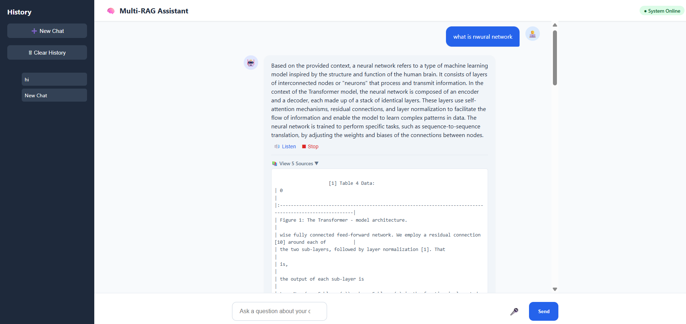
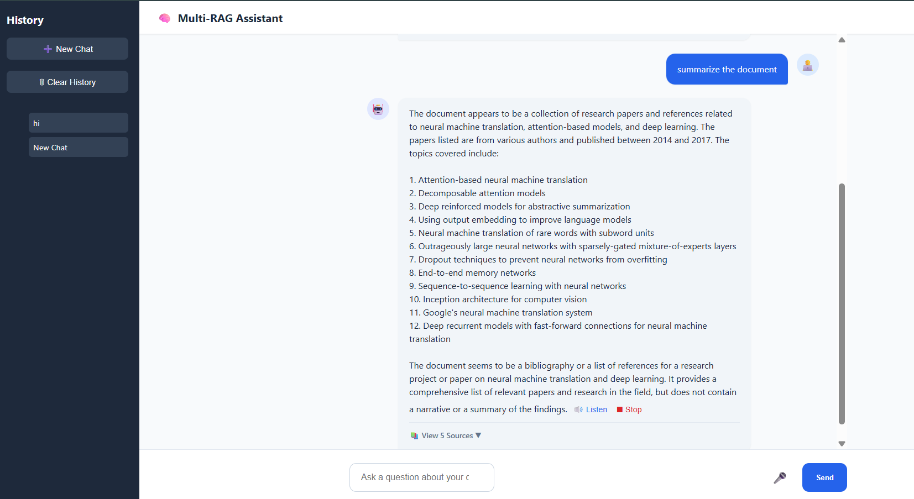

# 📄 Multimodal RAG-Based AI Document Assistant  
**Azure Blob Storage | Pinecone | Groq LLaMA | Gemini | FastAPI | Advanced UI**

---

## 🔍 Project Overview
This project implements a **Multimodal Retrieval-Augmented Generation (RAG) system** capable of answering user queries from **complex PDF documents** containing:

- 📄 Text  
- 📊 Tables  
- 📐 Mathematical formulas  
- 🖼️ Images & diagrams  

The system ingests PDFs from **Azure Blob Storage**, extracts and processes all modalities, converts them into semantic embeddings, stores them in **Pinecone**, and generates **accurate, context-aware answers** using **Groq LLaMA-3.3-70B**.

A **FastAPI backend** powers an **enterprise-style web UI** that supports:
- Multi-turn conversation memory
- Voice input (Speech-to-Text)
- Voice output (Text-to-Speech)
- Source viewing
- Chat history management

---
## 🖥️ UI Screenshots

### 🔹 Main Chat Interface
](image.png)

### 🔹 Multimodal Answer with Sources


### 🔹 Voice Input & Output



## 🎯 Problem Statement
Traditional document Q&A systems:
- Fail to understand tables, formulas, and images
- Struggle with large PDFs
- Lose context during follow-up questions
- Produce hallucinated answers
- Provide poor user experience

This project solves these problems by building a **scalable, multimodal, memory-enabled RAG system with a production-style UI**, similar to real-world **enterprise document intelligence platforms**.

---

## ✅ Key Features

### 🔹 Multimodal Intelligence
- Text extraction & chunking
- Table extraction
- Formula extraction
- Image extraction + captioning (Gemini)

### 🔹 RAG & AI
- Local embeddings (Sentence-Transformers)
- Pinecone semantic vector search
- Groq LLaMA-3.3-70B for fast inference
- Strict context-grounded answers
- Multi-turn conversation memory

### 🔹 Enterprise UI (index.html)
- Clean chat interface
- Sidebar with chat history
- View document sources per answer
- Typing indicator
- 🎤 Voice input (Speech-to-Text)
- 🔊 Voice output (Text-to-Speech)
- Reset chat / clear memory

### 🔹 Backend
- FastAPI-based REST API
- Modular & scalable architecture
- Ready for cloud deployment

---

## 🏗️ High-Level Architecture

Azure Blob Storage (PDF)
↓
Multimodal Extraction
(Text | Tables | Formulas | Images)
↓
Chunking & Captioning
↓
Local Embeddings (Sentence-Transformer)
↓
Pinecone Vector Database
↓
RAG Retrieval
↓
Groq LLaMA-3.3-70B
↓
FastAPI Backend
↓
Enterprise Web UI (HTML + JS)


---

## 🧩 Module-wise Explanation

### 1️⃣ Data Ingestion (`read_data.py`)
- Downloads PDF documents from **Azure Blob Storage**
- Reads files as byte streams
- Entry point of the indexing pipeline

---

### 2️⃣ Multimodal Extraction
- **Text** → Extracted & chunked (`chunking.py`)
- **Tables** → Extracted as structured text (`table.py`)
- **Formulas** → Extracted as mathematical expressions (`formula.py`)
- **Images** → Extracted and captioned using **Gemini API** (`img.py`)

Extracted outputs are stored in:
- `output_tables/`
- `output_formulas/`
- `output_images/`

---

### 3️⃣ Embedding Generation (`embedding.py`)
- Uses **Sentence-Transformers (all-MiniLM-L6-v2)**
- Fully local & free embedding generation
- Batch processing for performance

---

### 4️⃣ Vector Storage (`vector_store.py`)
- Uses **Pinecone Serverless**
- Cosine similarity-based search
- Rich metadata support:
  - `type` (text / table / formula / image)
  - `source`
  - `image_path`
- Batch upserts for efficiency

---

### 5️⃣ RAG & LLM Logic (`chat_app.py`)
- Converts user query to embeddings
- Retrieves top-K relevant chunks from Pinecone
- Generates grounded answers using **Groq LLaMA-3.3-70B**
- Maintains **conversation memory** for follow-up questions
- CLI chat mode for testing

---

### 6️⃣ Pipeline Orchestration (`main.py`)
- Runs the **complete indexing pipeline**
- Connects:
  - Download → Extract → Embed → Store
- Executed once per document ingestion

---

### 7️⃣ API Layer (`fast_api.py`)
- Built using **FastAPI**
- API Endpoints:
  - `POST /chat` → Ask questions
  - `POST /reset-chat` → Clear conversation memory
- Serves `index.html` as the UI
- Production-ready backend design

---

### 8️⃣ Frontend UI (`index.html`)
- Enterprise-style chat interface
- Sidebar with chat history
- Source viewer per response
- Typing animation
- 🎤 Speech-to-Text input
- 🔊 Text-to-Speech output
- Local session persistence (browser storage)

---

## 📂 Project Folder Structure

Multimodal_RAG_Project/
│
├── __pycache__/
│
├── output_formulas/          # Extracted mathematical formulas
├── output_images/            # Extracted images & captions
├── output_tables/            # Extracted tables
│
├── rag_env/                  # Python virtual environment
│
├── static/                   # Static files (CSS / JS if extended)
│
├── .env                      # Environment variables
├── requirements.txt          # Project dependencies
│
├── app.py                    # (Optional) App entry / experimentation
├── main.py                   # Full multimodal indexing pipeline
├── fast_api.py               # FastAPI backend server
├── chat_app.py               # RAG logic + Groq LLM + memory
│
├── read_data.py              # Azure Blob Storage PDF ingestion
├── chunking.py               # Text extraction & chunking
├── embedding.py              # Local embedding generation
├── vector_store.py           # Pinecone vector DB integration
│
├── img.py                    # Image extraction & Gemini captioning
├── table.py                  # Table extraction logic
├── formula.py                # Formula extraction logic
│
├── index.html                # Enterprise-style chat UI
│
└── README.md                 # Project documentation


---

## ⚙️ Tech Stack
- **Language**: Python  
- **Backend**: FastAPI  
- **Storage**: Azure Blob Storage  
- **Vector Database**: Pinecone (Serverless)  
- **Embeddings**: Sentence-Transformers  
- **LLM**: Groq LLaMA-3.3-70B  
- **Vision Model**: Google Gemini  
- **Frontend**: HTML, CSS, JavaScript  
- **Libraries**: LangChain, PyPDF2  

---

## 🔑 Environment Variables (`.env`)
```env
connection_url=AZURE_CONNECTION_STRING
container_name=AZURE_CONTAINER_NAME
blob_name=PDF_NAME.pdf

PINECONE_API_KEY=YOUR_PINECONE_KEY
PINECONE_INDEX_NAME=multimodal-rag-index

GROQ_API_KEY=YOUR_GROQ_KEY
Gemini_Api=YOUR_GEMINI_KEY

## ▶️ How to Run the Project

### 1️⃣ Install Dependencies
```bash
pip install -r requirements.txt

### 2️⃣ Run Indexing Pipeline (One Time)
```bash
python main.py

### 3️⃣ Start FastAPI Server
```bash
python fast_api.py

### 🌐 Open in Browser
```bash
http://localhost:8000


## 🧪 Example Use Case

**User:**  
“Explain the attention formula shown in the diagram.”

**System:**  
- Retrieves related text, formulas, and image captions  
- Generates a context-grounded answer  
- Allows voice playback of the response  
- Maintains memory for follow-up questions  

---

## 🚀 Future Enhancements
- PDF upload via UI  
- Highlight text sources in documents  
- Image rendering inside chat  
- Authentication and role-based access  
- Cloud deployment (Azure / AWS)  

---

## 📌 Conclusion
This project demonstrates a **practical and scalable Multimodal RAG-based document intelligence system** with an **enterprise-grade UI**, capable of answering questions over complex PDFs containing both textual and visual information. By combining efficient retrieval, grounded generation, multimodal understanding, and a rich user interface, the system closely mirrors **real-world enterprise AI document solutions**.
